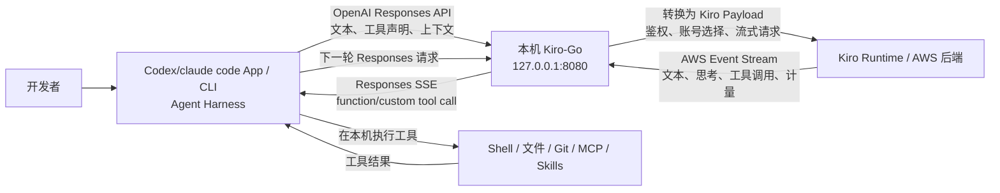

# Codex 使用 Kiro 模型与积分：架构与实现原理

> 文档版本：2026-08-12  
> 指定代码：[Vino1016/Kiro-Go `main_vino` 分支](https://github.com/Vino1016/Kiro-Go/tree/main_vino)  
> 本次验证版本：Kiro-Go `795b2ca`  
> 配套文档：[安装与配置手册](./codex-kiro-go-installation.md)

## 1. 目标与结论

这套方案让开发者继续使用 Codex 完整的 Agent / Harness 能力，包括：

- 读取和修改本地代码；
- 执行终端命令；
- 调用 MCP、Skills、Hooks 和插件；
- 处理审批、上下文、工具调用和多轮任务。

模型推理请求不再发往 OpenAI 官方模型 Provider，而是经过本机 Kiro-Go 转成 Kiro 上游协议，由 Kiro 账号提供模型并消耗 Kiro credits。

本方案可以简单理解为：将本机 Kiro-Go 作为模型协议网关，使 Codex、Claude Code、Hermes 等 Agent 能够调用 Kiro 内置模型，消耗kiro积分。

最终链路如下：



关键边界：

- **Codex / Claude Code 是 Harness**：任务规划、工具执行、权限和本地操作仍由 Codex 负责。
- **Kiro 是模型 Provider**：分析和生成由 Kiro 提供的模型完成，计量进入 Kiro 账号。
- **Kiro-Go 是协议网关**：负责 Responses 与 Kiro 协议转换，不是第二套 Agent Harness。
- **CC Switch 是配置切换器**：负责在 OpenAI 官方 Provider 和 Kiro-Go Provider 之间切换 Codex 配置。

因此，这不是“在一个 Provider 中混用两家的额度”。切到 `Kiro-Go Local` 后，该 Provider 下所有模型请求都走 Kiro-Go；要使用 OpenAI 官方模型和额度，需要切回 `default` Provider。

## 2. Kiro-Go 的作用、原项目与分支选择

### 2.1 Kiro-Go 的作用

Kiro-Go 是一个开源的模型协议网关，它将 Kiro 账号提供的模型能力转换为 OpenAI 和 Anthropic 兼容的 API 服务。Codex、Claude Code、Hermes 等支持这些协议的客户端，可以通过 Kiro-Go 调用 Kiro 模型，而无需直接适配 Kiro 上游协议。

在本方案中，Kiro-Go 位于 Codex 与 Kiro Runtime 之间，主要负责：

- 接收 OpenAI Responses、Chat Completions 或 Anthropic Messages 请求；
- 完成 Kiro 账号鉴权、账号选择和 OAuth Token 刷新；
- 将客户端请求转换为 Kiro 上游 Payload；
- 解析 AWS Event Stream，并将文本、思考、工具调用和计量信息转换回客户端兼容格式。

Kiro-Go 只负责协议转换与请求转发，不负责 Codex 的任务规划、工具执行和本地权限控制。这些 Agent Harness 能力仍由 Codex 提供。
Kiro-GO 支持配置多个kiro账号，会对上游请求进行轮询复杂均衡。
Kiro-GO 对每一次请求都会生成临时日志记录。

### 2.2 原项目与本文指定分支

Kiro-Go 的原项目地址是 [Quorinex/Kiro-Go](https://github.com/Quorinex/Kiro-Go)。本文方案基于该项目的派生分支，并固定使用：

```text
https://github.com/Vino1016/Kiro-Go/tree/main_vino
```

为确保功能与本文的验证结果一致，不要直接替换为上游项目的旧镜像或旧版本。`main_vino` 分支的提交 [`795b2ca`](https://github.com/Vino1016/Kiro-Go/commit/795b2caf95d81da2bf350d8667859e3edf77708c) 修复了两个影响 Codex 使用的关键问题。

### 2.3 Issue #151：新版 Codex 工具声明无法传给模型

新版 Codex 会把部分工具声明放进 Responses `input[].additional_tools`，其中包括：

- Codex 内置 `exec` custom tool；
- 普通 function tools；
- MCP/协作工具的 namespace 包装。

旧版 Kiro-Go 只读取顶层 `tools`，导致请求能够正常聊天，但 Kiro 模型看不到 Shell、文件、Git 和 MCP 工具。

`main_vino` 已补充：

- 提取 `additional_tools`；
- 展开 namespace 工具；
- 支持 `custom_tool_call` 和 `custom_tool_call_output`；
- 流式返回 Codex 能识别的 custom/function tool-call 事件；
- 清理 Kiro 不接受的工具 Schema 字段。

问题详情：[Quorinex/Kiro-Go #151](https://github.com/Quorinex/Kiro-Go/issues/151)。

- 注意kiro-GO中还有一个潜在问题，导致现在codex接入kiro-GO之后依然无法使用browser use和computer use两个codex的特色功能，修复方案有但比较麻烦这里就不做修复，需要使用这两个功能请使用自己的原生codex账号。

### 2.4 Issue #147：企业 IdC 账号被误判为截断响应

部分 IAM Identity Center / Enterprise Kiro 后端在成功响应时不会发送 `metadataEvent.stopReason`，而是：

```text
assistantResponseEvent → contextUsageEvent → meteringEvent → clean EOF
```

旧逻辑把这种完整响应误判为截断，导致企业账号所有请求失败。

`main_vino` 使用 `meteringEvent` 作为缺少显式 stop reason 时的备用终止信号：

- 普通文本完成映射为 `end_turn`；
- 已产生工具调用时映射为 `tool_use`；
- 真正中途断开的流没有 metering 帧，仍然会按截断处理。

问题详情：[Quorinex/Kiro-Go #147](https://github.com/Quorinex/Kiro-Go/issues/147)。

## 3. Kiro-Go 的实现原理

### 3.1 对外兼容接口

Kiro-Go 提供三类兼容接口：

| 接口 | 用途 |
| --- | --- |
| `/v1/messages` | Anthropic Messages 兼容客户端 |
| `/v1/chat/completions` | OpenAI Chat Completions 兼容客户端 |
| `/v1/responses` | Codex 使用的 OpenAI Responses 协议 |

Codex 自定义 Provider 由 `model_provider` 选择 Provider、由 `base_url` 指定 API 地址，`wire_api` 当前只支持 `responses`。Provider 配置必须放在用户级 `~/.codex/config.toml`，不能由项目级配置覆盖。参考 [OpenAI Codex 配置参考](https://learn.chatgpt.com/docs/config-file/config-reference)。

### 3.2 Responses 请求转换

一次 Codex 请求在 Kiro-Go 内部主要经过：

1. `/v1/responses` 路由进行 Kiro-Go API Key 鉴权。
2. 解析 `input`、`instructions`、历史消息和 `previous_response_id`。
3. 从顶层 `tools` 和 `input[].additional_tools` 提取工具声明。
4. 将 Responses 消息、图片、function/custom tools 转换成 Kiro `conversationState`。
5. 根据请求模型选择支持该模型的已启用 Kiro 账号。
6. 刷新 OAuth Token，或者使用 Kiro API Key。
7. 调用 Kiro IDE、CodeWhisperer、Amazon Q 或 Kiro CLI Runtime。
8. 解析 AWS Event Stream，恢复文本、思考、工具调用、Token 和 credits。
9. 重新输出 Codex 能识别的 Responses JSON 或 SSE 事件。

### 3.3 模型名与积分归属

例如 CC Switch 中配置：

```text
菜单显示名：gpt-5.6-sol-kiro
实际请求模型：gpt-5.6-sol
```

`-kiro` 只是人为添加的菜单后缀，用于区分额度来源。Kiro-Go 收到的实际模型 ID 仍是 `gpt-5.6-sol`。

只要当前 `model_provider` 的 `base_url` 是：

```text
http://127.0.0.1:8080/v1
```

该 Provider 下选择的所有模型都会调用 Kiro-Go，模型推理消耗 Kiro credits。即使模型名看起来像 OpenAI 原生模型，也不会绕过 Kiro-Go 调用 OpenAI 官方 API。

### 3.4 CC Switch 的作用

> 如果不希望使用cc-switch，可以直接在codex中配置proxy，直接让ai帮你配置即可，只是直接配置后做切换比较麻烦，适合自己没有开通gpt会员只使用kiro积分的开发者

CC Switch 负责：

- 保存 `default`（OpenAI 官方 Codex）和 `Kiro-Go Local` 两套 Provider；
- 切换用户级 Codex Provider、认证和模型目录配置；
- 生成 `model_catalog_json`，让 Codex `/model` 显示 Kiro 模型；
- 一键恢复 OpenAI 官方 Provider。

CC Switch 不提供模型、不结算 Kiro credits，也不执行 Codex 工具。由于 `main_vino` 已原生提供 `/v1/responses`，本方案关闭 CC Switch Local Routing，避免再增加一层 Chat Completions 到 Responses 的转换。

## 4. 前置条件、安全要求与适用边界

开始前确认：

- 已安装 Codex App 或 Codex CLI；
- 有可用且获授权使用的 Kiro 账号；
- 使用 macOS 12+；
- 已安装 Homebrew；
- 如果用 Docker 部署需安装 Docker Desktop，原生本机部署需安装 Go 1.21+。

安全要求：

- Kiro-Go 只监听或映射到 `127.0.0.1:8080`，不要暴露到公司局域网或公网；
- 开启 Kiro-Go API Key 鉴权；
- 不在 Git、文档、命令历史或群聊中记录真实账号凭证和 API Key；
- `data/config.json` 含敏感凭证，备份文件也必须妥善保管；

适用边界：

- 这是第三方兼容方案，不是 OpenAI 或 Kiro 官方联合集成；
- Codex Responses 请求结构和 Kiro 上游协议升级后都可能产生兼容性变化；
- 不同 Provider 不保证可以安全续接同一条 Responses 状态链，建议切换模型后新建任务；
- Codex、Kiro-Go 或 CC Switch 更新后，应重新验证文本生成、工具调用、MCP、流式输出。

## 参考资料

- [Kiro-Go 原项目 Quorinex/Kiro-Go](https://github.com/Quorinex/Kiro-Go)
- [安装与配置手册](./codex-kiro-go-installation.md)
- [Vino1016/Kiro-Go `main_vino`](https://github.com/Vino1016/Kiro-Go/tree/main_vino)
- [修复提交 `795b2ca`](https://github.com/Vino1016/Kiro-Go/commit/795b2caf95d81da2bf350d8667859e3edf77708c)
- [Kiro-Go Issue #151](https://github.com/Quorinex/Kiro-Go/issues/151)
- [Kiro-Go Issue #147](https://github.com/Quorinex/Kiro-Go/issues/147)
- [OpenAI Codex 配置参考](https://learn.chatgpt.com/docs/config-file/config-reference)
